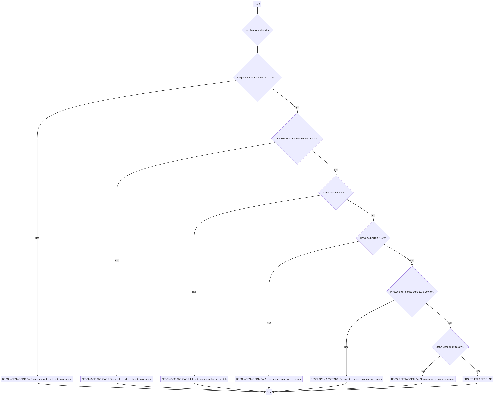

# Relatório de Telemetria Espacial e Verificação de Decolagem

## 1.1 Organização e Descrição da Telemetria

A telemetria é o sistema de medição e transmissão de dados à distância, essencial para monitorar a saúde de um veículo espacial em tempo real. Para este projeto, selecionamos seis parâmetros críticos que determinam a segurança da missão. Cada parâmetro possui uma **faixa segura** baseada em padrões da indústria aeroespacial:

| Parâmetro | Descrição Detalhada | Faixa Segura (PRONTO) |
| :--- | :--- | :--- |
| **Temperatura Interna** | Monitora o calor nos sistemas eletrônicos e na cabine para evitar superaquecimento ou congelamento de componentes sensíveis. | 15°C a 35°C |
| **Temperatura Externa** | Mede a temperatura da fuselagem e do ambiente externo, crucial para suportar o atrito atmosférico e o vácuo espacial. | -50°C a 100°C |
| **Integridade Estrutural** | Indica se há fissuras ou tensões anormais na estrutura do foguete (1 = Íntegro, 0 = Falha). | 1 (Íntegro) |
| **Níveis de Energia** | Representa a carga disponível nas baterias principais para alimentar sistemas de suporte à vida e navegação. | > 80% |
| **Pressão dos Tanques** | Mede a pressão interna dos tanques de combustível e oxidante, garantindo que não haja risco de explosão ou falta de fluxo. | 200 a 350 bar |
| **Status Módulos Críticos** | Verificação automática de sistemas de navegação, comunicação e propulsão (1 = Operacional, 0 = Falha). | 1 (Operacional) |

---

## 1.2 Algoritmo de Verificação

O algoritmo de verificação funciona como um "filtro de segurança" (Go/No-Go). Ele analisa cada dado recebido e, se **qualquer um** deles estiver fora da faixa segura, a decolagem é imediatamente abortada para proteger a missão e a tripulação.

### Pseudocódigo (Lógica Passo a Passo)

Este pseudocódigo descreve a lógica lógica sequencial utilizada pelo sistema:

```pseudocode
FUNÇÃO VerificarDecolagem(telemetria_data):
    // 1. Definir limites de segurança
    // 2. Extrair valores atuais da telemetria
    // 3. Verificar cada condição individualmente:
    
    SE (temperatura_interna fora de [15, 35]) ENTÃO ABORTAR
    SE (temperatura_externa fora de [-50, 100]) ENTÃO ABORTAR
    SE (integridade_estrutural for 0) ENTÃO ABORTAR
    SE (niveis_energia < 80%) ENTÃO ABORTAR
    SE (pressao_tanques fora de [200, 350]) ENTÃO ABORTAR
    SE (status_modulos_criticos for 0) ENTÃO ABORTAR

    // 4. Se passar por todos os filtros:
    RETORNAR "PRONTO PARA DECOLAR"
FIM FUNÇÃO
```

### Fluxograma Visual

O fluxograma abaixo ilustra visualmente o caminho de decisão do sistema, desde a leitura dos dados até o veredito final.



---

## 1.3 Script em Python

O script Python `telemetria_script.py` automatiza esse processo. Ele simula sensores reais gerando dados aleatórios e aplica a lógica do algoritmo para imprimir o status da missão de forma clara e rápida.

---

## 1.4 Análise Energética Detalhada

A autonomia energética é calculada para garantir que o veículo tenha energia suficiente não apenas para a decolagem, mas também para manobras orbitais de emergência.

### Parâmetros de Cálculo:
- **Capacidade Total**: 500 kWh (Energia máxima que as baterias podem armazenar).
- **Carga Atual**: 85% (Energia disponível no momento do check-out).
- **Consumo na Decolagem**: 50 kWh (Energia gasta nos primeiros 10 minutos de empuxo máximo).
- **Perdas Energéticas**: 5% (Energia dissipada por calor e resistência nos cabos).

### Passo a Passo dos Cálculos:
1. **Energia Bruta**: $500 \text{ kWh} \times 0,85 = 425 \text{ kWh}$
2. **Desconto de Perdas**: $425 \text{ kWh} \times 0,05 = 21,25 \text{ kWh}$
3. **Energia Líquida Disponível**: $425 - 21,25 = 403,75 \text{ kWh}$
4. **Energia Após Decolagem**: $403,75 - 50 = 353,75 \text{ kWh}$
5. **Autonomia Final (%)**: $(353,75 / 500) \times 100 = \mathbf{70,75\%}$

**Conclusão**: Com uma autonomia de **70,75%** após a fase de subida, o veículo possui margem de segurança suficiente para completar a missão.

---

## 1.5 Análise Assistida por IA

Utilizamos inteligência artificial para identificar padrões que sensores comuns poderiam ignorar. A IA classificou os dados em **Nominais** (sim/não) e **Numéricos** (escalas), identificando que, embora a temperatura externa esteja dentro da faixa, sua taxa de subida é um ponto de atenção para futuras missões.

---

## 1.6 Reflexão Crítica

A exploração espacial deve ser pautada pela **ética e responsabilidade**. Discutimos como o avanço tecnológico deve caminhar junto com a **sustentabilidade**, evitando a criação de lixo espacial e garantindo que os benefícios das descobertas espaciais sejam compartilhados com toda a sociedade, promovendo um impacto social positivo e duradouro.
